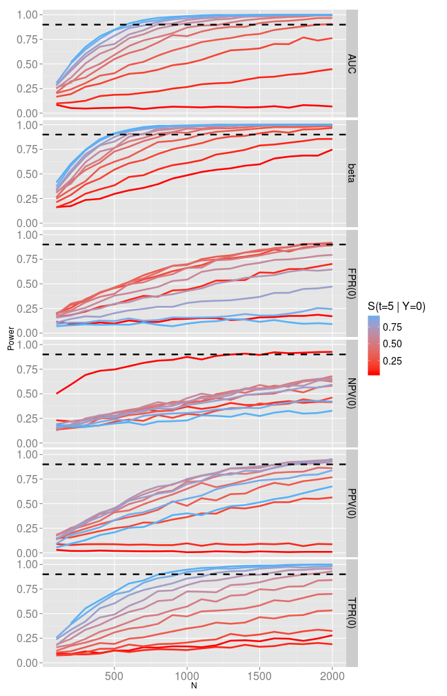

Power calculations for prognostic biomarker validation studies
========================================================

## Setting

  Risk prediction biomarker validation. 
  
  biomarker $Y$, and cutoff value $c$ so that $Y>c$ is considered 'high risk' and $Y<c$ 'low risk.'
  
  - How well does the biomarker $Y$ classify subjects into the 'high' risk or 'low' risk groups?

  We have censored time-to-event data: 
  $(x_i, d_i, Y_i)$
  
  - How well does the biomarker $Y$ classify subjects into the 'high' risk or 'low' risk groups at time $t_{predict}=5 (years)$
  
  - If the event of interest is cancer recurrence : How well does biomarker $Y$ predict 5 year disease free survival

  
  
### Measures

  * True positive rate: $TPR_t ( c ) = P(Y > c | T \le t_{predict})$
    - Given the event occurs before $t_{predict}$ what is the probability they are classified high risk? 
  * False positive rate: $FPR_t ( c ) = P(Y > c | T > t_{predict})$
    - Given the event occurs after $t_{predict}$ what is the probability they are classified high risk? 

  * Area under the ROC curve: $AUC_t = \int_0 ^1 TPR_{t_{predict}} (FPR_{t_{predict}} ^{-1}(u)) du$ 
    - independent of marker cutoff value $c$. 

## Goal

  Build an easy to use tool to aid researchers in designing studies for prognostic biomarker validation studies. 
    
### Problem

$$
H_0 : A \le A_0 \; vs. \\
H_a : A > A_0
$$

where $A_0$ is the minimal performance requirement for the marker.

$$
n = \frac{\{\phi^{-1}(1-\alpha) + \phi^{-1}(1-\beta)\}^2 \sigma^2}{(A_0 - A_{expected})^2}
$$

However, obtaining a value for $\sigma^2$, the asymptotic variance of $\hat{A}$, is difficult.

## Our Solution

1. Simulate time to event data such that $A = A_{expected}$. 
2. Do this several times to obtain an estimate for $\sigma$ via the sampling distribution of $\hat{A}$.
3. Get an estimate of the sample size needed $n$ using formula above. 
4. Given a sample size $n$, generate data sets and check the power performance with respect to your measure of interest and other measures. 

## Methods

### Modeling
In order to generate time to event data such that the performance of the marker yields $A_{expected}$ for a given measure, we make the following modelling choices:

* Distribution of the marker $Y$: This application assumes $Y \sim N(0,1)$. More options for the distribution of $Y$ may be added later.  

* The failure time $T$: We model survival via the survival function $S(t |Y) = P(T >t|Y)$ and assume a Cox-Proportional hazards model:

$$
S(t|Y) = S_0 (t)^{e^{\beta Y}}
$$

where the baseline survival distribution $S_0(t)$ is assumed to be exponential:
$$
S_0(t) = e^{-at}
$$

The value for $a$ is determined by the inputs for baseline survival $S_0(t_0)$ for a given time $t_0$, and the value for $\beta$ is determined by the expected value of the accuracy measure of interest. 

* Censoring: We assume non-informative censoring.  

### Estimation

Estimates for all measures can be calculated via non-parametric or semi-parametric methods. Non-parametric estimates are computed using double inverse probability weighting (DIPW), and semi-parametric estimates assume a Cox proportional hazards model. An R package that implements the estimation procedures used in this application is available [**here**](http://mdbrown.github.io/survAccuracyMeasures/). Please see the referenced papers for detailed information regarding estimation. 

  

## Implementation

### Shiny
  - [simple example](http://spark.rstudio.com/uafsnap/RV_distributions/)
  - [Power App](http://glimmer.rstudio.com/mdbrown/PowerSAM/)
  - [other](http://mdbrown.shinyapps.io/twitclouds/)
  
## Results

 

